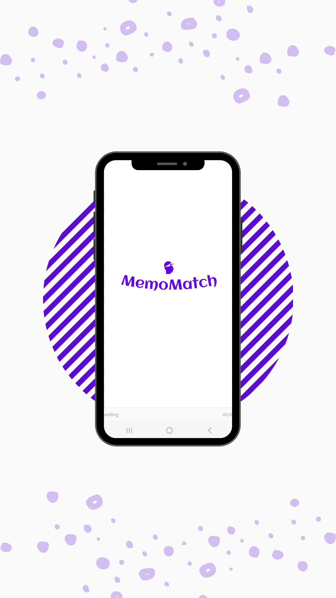
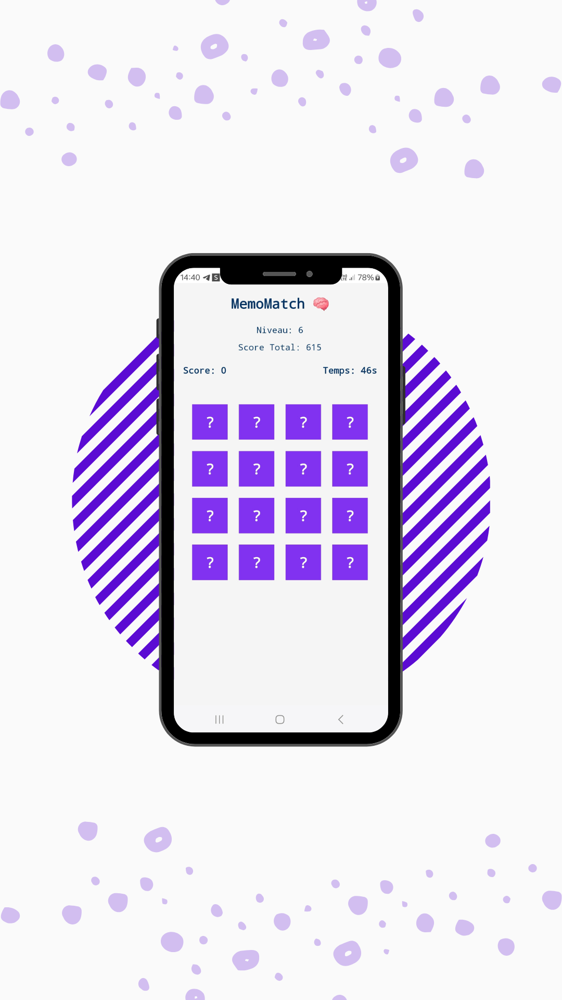
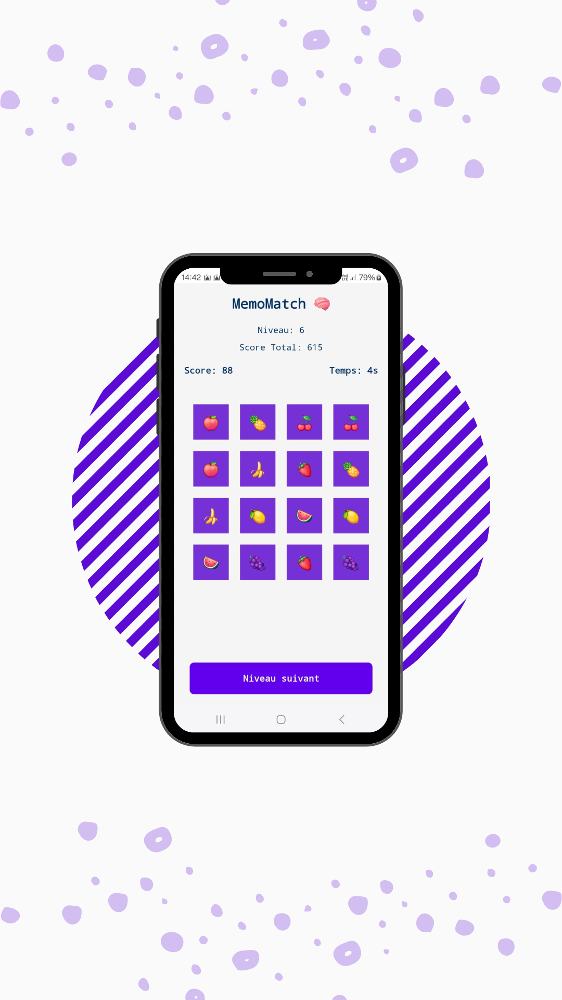
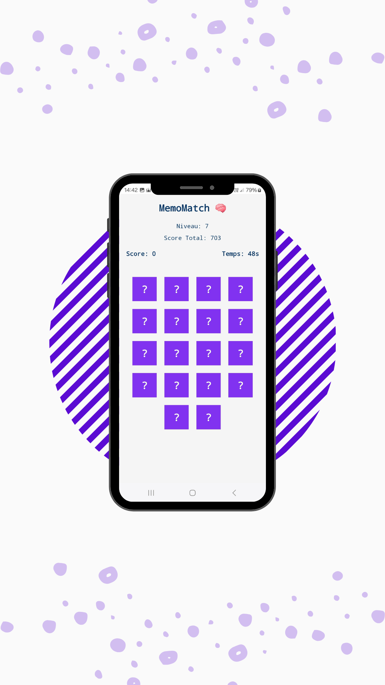

# MemoMatch 🧠

 
   

# 📝 Description

MemoMatch is a memory card game built with React Native and Expo. Test your memory by matching pairs of cards before the timer runs out! The game features multiple levels, total score tracking, and automatic state saving so you can resume anytime.

# Features
- **Difficulty Levels** : The game progressively becomes more challenging as you advance through levels.
- **Score and Total Score** : Each level has its own score, and a total score accumulates all points earned.
- **Integrated Timer** : A time limit for each level adds excitement and pressure to the game.
- **Sound Effects** : Interactive sounds for card flipping, successful matches, and game over.
- **Game State Saving** : Levels and scores are saved automatically, so you can pick up where you left off.
- **Stylish UI with React Native Paper** : A modern and interactive design using the React Native Paper library.

#

 &nbsp;&nbsp;&nbsp;&nbsp;
  

 &nbsp;&nbsp;&nbsp;&nbsp;

 

## Code Overview
**App.js**
This file contains the main logic for:

- Displaying the current level and total score.
- Controlling the game state with AsyncStorage to save the level and score.
- Methods loadGameState and saveGameState for retrieving and saving the game's state.

**GameBoard.js**
The main game component, GameBoard, is responsible for:

- Game logic for each level.
- Managing cards with flipping, matching, and game-over checks.
- Timer functionality with a countdown display.
- Sound effects using expo-av for an immersive experience.
